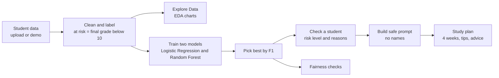

<div align="center">

# 🎓 EduSense AI

### Early-warning and study coach for students

**Spot students who need help before they fall behind.**


**1M1B × IBM SkillsBuild × AICTE · AI for Sustainability Virtual Internship**

**Built by:** Shruti Halle · **College:** SNDT Arts and Commerce College for Women,Pune

[💼 LinkedIn](https://www.linkedin.com/in/shruti-halle) 

</div>

---

## 📌 Table of contents
1. [The problem](#-the-problem)
2. [Our solution](#-our-solution)
3. [Screenshots](#-screenshots)
4. [Features](#-features)
5. [How it works](#-how-it-works)
6. [Machine learning details](#-machine-learning-details)
7. [Responsible AI](#-responsible-ai)
8. [AI study plan and IBM Granite](#-ai-study-plan-and-ibm-granite)
9. [Tech stack](#-tech-stack)
10. [Run it yourself](#-run-it-yourself)
11. [Project structure](#-project-structure)
12. [Expected impact](#-expected-impact)
13. [Roadmap](#-roadmap)

---

## 🎯 The problem

**How might we use AI to spot struggling students early so that every learner can get support in time?**

Many students fall behind quietly. Teachers manage large classes, and warning signs such as rising absences, falling grades and low study time are usually noticed only after exams. By then, catching up is hard and confidence is low.

This matters for **UN Sustainable Development Goal 4: Quality Education**, which aims for inclusive and equitable education for all. A secondary link is **SDG 10: Reduced Inequalities**, because students with less support at home are the ones most often missed.

## 💡 Our solution

EduSense AI is a simple web app for **teachers, tutors and parents**. It does three things:

| Step | What happens |
|---|---|
| **1. Explore** | Shows clear charts of how attendance, study time and grades connect. |
| **2. Check** | A machine-learning model gives a student a **Low / Medium / High** risk level and lists the main reasons. |
| **3. Support** | Turns the result into a kind, practical **4-week study plan** that can be downloaded. |

> A risk level is a **nudge to help**, never a label. People make the decisions. The model only supports them.

## 🖼️ Screenshots

| | | |
|:---:|:---:|:---:|
| <br>**Home**: what the app does | <br>**Explore Data**: overview of the data | <br>**Charts**: attendance, study time and grades |
| <br>**Grade distribution**: at risk vs not at risk | <br>**Relationships**: what moves with grades | <br>**Check a Student**: enter a profile |
| <br>**Risk result**: gauge and main reasons | <br>**Study Plan**: a friendly 4-week plan | <br>**Model performance**: models compared |

## ✨ Features

- 📂 **Bring your own data** or use the built-in demo dataset (520 students). Supports the UCI *Student Performance* file (`student-mat.csv`).
- 📊 **Explore Data**: five charts, key insights, and a plain-English note under every chart.
- 🤖 **Risk prediction**: Logistic Regression and Random Forest are trained and compared. The best model is picked by F1 score.
- 🔍 **Explainable results**: feature-importance chart, plus the top 3 reasons for each student.
- 🧑‍🏫 **Ready-made examples**: *Typical student*, *Needs support* and *Doing well*, so anyone can try it in seconds.
- 📝 **Study plan**: summary, 4-week plan, 3 motivational tips and advice for teachers and parents, with a `.txt` download.
- ⚖️ **Fairness checks** across sex and internet access.
- 🔒 **Privacy by design**: no names, nothing stored, everything is processed in the session only.
- 🎨 **IBM Carbon-inspired design**: clean, accessible, mobile-friendly.

## ⚙️ How it works



## 🧪 Machine learning details

| Item | Detail |
|---|---|
| **Dataset** | UCI Student Performance (Math) or a synthetic demo set with the same columns |
| **Target** | `at_risk = 1` if final grade `G3 < 10` (out of 20) |
| **Features** | study time, past failures, absences, G1, G2, health, free time, going out, parents' education, internet, school support, family support, higher-ed plans, age |
| **Not used for training** | `sex` (kept only for fairness checks) |
| **Split** | Stratified 75 / 25 train and test |
| **Models** | Logistic Regression, Random Forest (both class-balanced) |
| **Metrics** | Accuracy, precision, recall, F1, confusion matrix, ROC curve |
| **Selection** | Highest F1 score |
| **Explainability** | Feature importance and per-student top factors |
| **Risk bands** | Low below 33%, Medium 33 to 66%, High above 66% |

> **Note:** G1 and G2 are earlier grades, so they are strong predictors. That fits an early-warning use case, but the app also highlights habits like absences and study time that a teacher can act on.

## 🛡️ Responsible AI

| Principle | How EduSense AI applies it |
|---|---|
| **Fairness** | `sex` is excluded from training. Accuracy and recall are compared across groups (sex, internet access) and gaps are shown openly. |
| **Transparency** | Feature importance, top reasons per student, and the exact AI prompt are all visible in the app. |
| **Privacy** | No names or personal identifiers are collected, sent or stored. Data lives only in the session. |
| **Ethics** | Built to support teachers, never to replace them. Results must not be used to punish, rank or label students. |
| **Limitations** | Small dataset from two schools, a proxy target (final grade), and results that may not transfer to other countries or curricula. |

## 🧠 AI study plan and IBM Granite

The whole app talks to the AI through **one function**: `generate_study_plan()` in `granite_client.py`.

- Today it returns a **rule-based template plan** and shows a "Demo mode" banner.
- The prompt builder (`build_prompt`) is complete, privacy-safe and visible in the app.
- The **IBM Granite** model (via IBM watsonx.ai) plugs into that single function by setting `USE_AI = True`. Nothing else in the app has to change.

Keep API keys in environment variables or Replit Secrets. Never commit them.

```
WATSONX_API_KEY=your-key
WATSONX_PROJECT_ID=your-project-id
WATSONX_URL=https://us-south.ml.cloud.ibm.com
```

## 🧰 Tech stack

**Python** · **Streamlit** · **pandas** · **NumPy** · **scikit-learn** · **Plotly** · **Matplotlib** · **Seaborn** · **IBM Granite (watsonx.ai)**, plug-in ready

## 🚀 Run it yourself

```bash
# 1. Clone
git clone https://github.com/YOUR-GITHUB-USERNAME/edusense-ai.git
cd edusense-ai

# 2. (Optional) create a virtual environment
python -m venv .venv
source .venv/bin/activate      # Windows: .venv\Scripts\activate

# 3. Install
pip install -r requirements.txt

# 4. Run
streamlit run app.py
```

Then open the local link Streamlit prints. **No data upload, images or API keys are needed.** The app works out of the box with the demo dataset.

**Optional images:** put your own illustrations in `assets/` as `hero.png`, `step1.png`, `step2.png`, `step3.png`, `classroom.png`, `coach.png`. If any are missing, built-in illustrations are used.

## 📁 Project structure

```
edusense-ai/
├── app.py               # Streamlit UI, pages, charts, session state
├── data_utils.py        # Data loading, cleaning, synthetic data
├── model.py             # Training, metrics, predictions, explainability
├── fairness.py          # Group fairness tables and summary
├── granite_client.py    # Safe prompt builder + AI study-plan boundary
├── requirements.txt
├── student-mat.csv      # UCI Student Performance: Math (optional)
├── student-por.csv      # UCI Student Performance: Portuguese (optional)
├── .streamlit/
│   └── config.toml      # Theme and server settings
├── screenshots/         # README screenshots (1.png to 9.png)
└── assets/              # Optional app illustrations (hero.png, step1.png ...)
```

## 🌍 Expected impact

- **Earlier help:** teachers can start a supportive conversation weeks before exams.
- **Less guesswork:** clear reasons replace vague worry.
- **More equity:** students with less support at home are less likely to be missed.
- **Time saved:** a ready-to-use study plan gives tutors and parents a starting point.
- **Scalable:** the same approach works for any school that tracks grades and attendance.

## 🗺️ Roadmap

- [x] EDA dashboard and two-model comparison
- [x] Explainable risk prediction
- [x] Fairness and privacy checks
- [x] Beginner-friendly, mobile-ready design
- [ ] Connect IBM Granite (watsonx.ai) for generated study plans
- [ ] Add Portuguese-language dataset and more subjects
- [ ] Multi-language plans (Hindi, Marathi)
- [ ] Class-level view for teachers

## 🙏 Acknowledgements

- Dataset: P. Cortez and A. Silva, *Student Performance*, UCI Machine Learning Repository.
- 1M1B, IBM SkillsBuild and AICTE for the AI for Sustainability Virtual Internship.

---

## 👩‍💻 Author

**Shruti Halle**: BCA graduate focused on data analytics and data engineering.
Connect on [LinkedIn](https://www.linkedin.com/in/shruti-halle).

---


*EduSense AI is a decision-support demo. It does not replace teacher judgment.*

</div>
